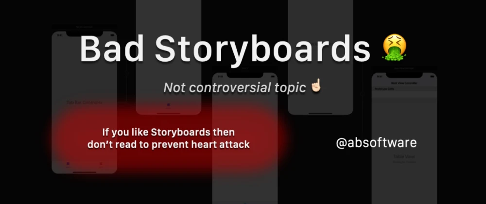

There is no benefit to using Xcode Storyboards at all! Not even one! This article presents the complete list of reasons. But first, have some lemon balm or something else to calm you down before reading especially when you like this tool.

## When did it happen? 🤦🏼‍♂️

I couldn't write my first post about something else after long years of development an iOS applications. How could I expect that it's so terrible when iOS SDK 5.0 brought wonderful ARC (automatic reference counter) and Storyboards to improve our performance at work. Everyone started using it to be more modern and write less code 🤩 The best code is the one that doesn't exist. Sounds right?

## No way ✋🏻

It took more than two years to show all bad consequences of using this tool. But Storyboards became a real enemy when product owner requested changes using kind words:

> Please change fonts, colors and margins in all views but only for one brand. We are going to rebrand the app.

Change what?! 🧐 😱

## Full list of faults

Full list of cons is long so description for each point is short and full educational explanation will be delivered in other articles of the serie [Bad Xcode Storyboards](https://dev.to/absoftware/series/8691). Points are ordered starting from the most annoying from my perspective of experience with Storyboards based on three commercial projects.

### 1. Weak reusability

Reusability is almost non-existence without additional effort. It's related to reusability of view controllers and single views. Good architecture assumes that you can easily customise the app. That you can easily change fonts, colors, margins or add another theme for new brand just by changing a few lines of your code. It's true that you can use Storyboard references to use external view controller from another Storyboard file or set custom class for views like labels. Would you like to do it every time when creating every single label, button or switch? Base classes for all basic UI components are very helpful to easily configure your UI. However it's extremely not comfortable when using Storyboards.

### 2. Storyboards are set of hardcoded and not reusable values

How many times did you report in code review that someone needs to use constant for hardcoded integer value? Because you know bad consequences of it. Hardcoded value has no meaning and no association with other occurrences. Guess what? All dimensions, colors, fonts are hardcoded in Storyboards and nobody cares. It's very similar to previous point but this point is related to reusability of single scalar values instead of view or view controllers. Ok, so lets change now fonts and margins in views from all our 75 view controllers implemented using Storyboards 💣

### 3. Post-configuration in source code

You need to write code for views anyway even when using Storyboards. Not everything is predicted to be configured using Storyboards and these files can't read your global configurations for your views. So very often it ends with post-configuration in methods like `viewDidLoad`. Then it's hard to keep consistency of the code because some properties are set in Storyboards and others in source code. Wouldn't be it better to keep configuration of views only in one location and format?

### 4. Broken preview

In most cases preview shows nothing useful. You can of course use `@IBDesignable` and `@IBInspectable` just to maintain preview in Storyboards 😎 Why not if someone has a lot of time and power? 💪🏻 But wait, how to edit views which are located under another one or out of the bounds? Where is this transparent view?! Where are shadows, borders and rounded corners? 🤣 It's the only candidate to defend Storyboards but this failed too. Hopefully live preview introduced for SwiftUI solves this problem much better.

### 5. Storyboards fail at runtime

Some properties are not validated in compilation time. So in case of forgotten identifiers of view controllers, cells, or other views you will get exception at runtime. It means that you can miss that and release to the end user when tests don't catch the issue. It's very sensitive for stupid mistakes like typos. So when you write code like this

```swift
let storyboard = UIStoryboard(name: "StorybardName", bundle: Bundle.main)
let viewController = storyboard.instantiateViewController(withIdentifier: "MyViewController") as! MyViewController
```

you use two string identifiers like `"StorybardName"` and `"MyViewController"` which are not validated in compilation time. It's much simpler to do just

```swift
let viewController = MyViewController()
```

and it's not bug prone.

### 6. Forgotten `@IBOutlet` and `@IBAction`

More over there are things which are not validated even in runtime like forgotten assignments for `@IBOutlet` or `@IBAction`. It's more related to Objective-C where you can call method or use properties on `nil` without crash. That's why it's better to use

```swift
@IBoutlet weak var myView: UIView!
```

instead of

```swift
@IBOutlet weak var myView: UIView?
```

in Swift. However it's still only runtime validation. But you can do nothing to detect missing `@IBAction` automatically. The same issue is related to forgotten class names for your custom views. All these worries take your time and bring lower quality of the end result if you don't catch your mistake yourself.

### 7. Merge conflicts

Storyboards are unpredictable XML files. Every saving can change order of XML elements or attributes randomly without special reason. Would you like write views in your team? Assign maximum one developer per Storyboard file.

### 8. Code reviews are almost impossible

It's very difficult to make code review for Storyboard files. These XML-s files are based on some elements and attributes which are unkown for most of developers. More over it's extremely hard to imagine what they present when reading its content.

### 9. Storyboards are slow

Xcode has troubles with performance when Storyboard file is opened even if there is only one view controller. It shows beach death ball very often when it freezes ⛱ I need to admit that it has been improved last time however files with source code are always faster 🚀

### 10. Storyboards are buggy

Haven't you got troubles with strange dimensions converted from 50.0 to 49.9999? Or changed frames without your awareness? Added some strange XML elements at the end after each save? Troubles to align views correctly especially when changing device for preview? It happened to me many times.

### 11. Not friendly translations

I hate these strange identifiers with unreadable format for humans like

```
/* Class = "UILabel"; text = "English text in Storyboard"; ObjectID = "LSm-a6-m9b"; */
"LSm-a6-m9b.text" = "Polish translation";
```

It would be much simpler to keep all translations in common file `Localizable.strings` to make them reusable for all views like

```
"English text" = "Polish translation";
```

and use in source code function like

```swift
func localizedString(_ text: String) -> String {
    return NSLocalizedString(string, comment: "")
}
```

to gain access to translations. More over it would be even possible to introduce validation in compilation time introducing `enum` for translations to have full control over translations in our project that we could not miss any translation.

### 12. Hard debugging of constraints

Sorry but this tree of constraints is almost not manageable. Better is when you select one particular view to see its constraints. However editing of properties for constraints means mouse acrobatics on the desk and it's hard to make easy overview of settings. And what about forgotten `@IBOutlet` for constraint? That's the pain of lost day 🤕

### 13. Segues paradox

That's difficult part to explain. However existence of segues suggest that we should make Storyboards as big as possible that our story could be complete, that you could see all associations between view controllers visually in this very big and beautiful Storyboard.

On the other hand we know what are consequences of using very big Storyboards. They are difficult to maintain and editor slowdowns proportionally to the number of view controllers in your story. Developers very often decide to keep Storyboards with only a few view controllers or even only one using partially segues and partially using transitions between view controllers in source code. It makes your project inconsistent.

So purpose of Segues seems to be irrational.

### 14. Mouse clicking

Day with Storyboards serves you terrible pain in your hand because of mouse clicking. Bloodshot eyes from straining to look for another text field or checkbox. Have I really set constraint to safe area? Or was it margin? Lets check again... Oh no, which tab of properties should I switch to again?  Jumping between Storyboard and source code is also fun. But hey, I'm not wasting time for writing difficult source code.

### 15. Context switching

Storyboards serve you not only pain in hands or eyes. Your brain may explode 🤯 because of switching between source code and Storyboards having content with different kind of presentation and nature. So brain needs to switch from source code mode to tracking visual components of Storyboards and vice versa when going back. And you need to remember what you actually was doing in previous context. Context switching takes time and makes you exhausted 😵

### 16. Extremely difficult refactoring

Haven't you tried to reorganise view hierarchy of your Storyboard's view controllers? It better to delete all and build it from scratch when changes are more revolutionary. Otherwise you will lost yourself in the middle of your work.

### 17. Storyboards require additional maintaining

Storyboards don't make job for you. If you don't want to write source code then you must click this with mouse. But Storyboards are one additional more layer which brings bugs you can't fix, new therms like segues or `@IBOutlet/@IBAction` you need to know and remember about. And even more you can spend extra time implementing and testing `@IBDesignable/@IBInspectable` or custom segues. So you need to deal with these things but they wouldn't be needed if you were not using Storyboards. So it's extra layer of worry.

## There is some good about Storyboards

No, there is not!

## Final result

_Programmatic views_ **17** : **0** _Xcode Storyboards_

## Horrible Storyboards

I've found similar article [Horrible Storyboards](https://gist.github.com/iraycd/01b45c5e1be7ef6957b7). It mentions about another issues which I haven't experienced yet like:

> - Storyboards don't let you change the type of special view controllers
> - Storyboards add two extra liabilities to your project
> - Storyboards don't allow you to add a subview to a `UIImageView`
> - Storyboards don't allow you to enable Auto Layout for individual View(-Controller)s
> - Storyboards have a higher risk of breaking backwards compatibility

## What are alternatives?

It appears that writing views programmatically is not easy either. Apple didn't provide easy in use classes and methods to write views easily. At least notation could be shorter however concept of constraints itself is quite good in UIKit. That's why people invented a lot of DSL (domain-specific language) libraries like the most popular [SnapKit](https://github.com/SnapKit/SnapKit), tricky [Carthography](https://github.com/robb/Cartography) or super concise [Stevia](https://github.com/freshOS/Stevia). I invented my own DSL AutoLayout library [LayoutExtension](https://github.com/abswift/layout-extension) which is now in early version however I use it in one commercial project with full success.
